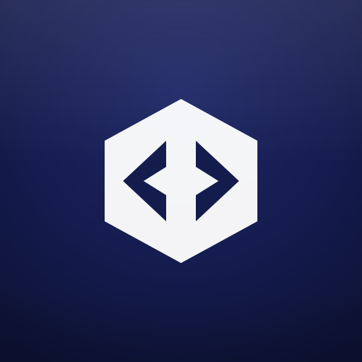

# 🚪 CodeLobby

<div align="center">



**The Future of Software Development is Not About Code.**

*It's about Intent.*

Built with Electron • React • TypeScript • GraphQL

</div>

---

## 🔮 The Vision

> *"In the future, engineers won't navigate to files and edit lines of code. They'll navigate to PRs and address intents."*

CodeLobby is built on a radical premise: **the Pull Request is the new atomic unit of software development**, not the file.

### The Paradigm Shift

| Traditional IDE | CodeLobby |
|-----------------|-----------|
| **Folder** → File → Line | **Repo** → PR → Comment/CI |
| Navigate to code | Navigate to problems |
| Edit syntax | Express intent |
| You write code | AI executes intent |

### What We See Coming

Software engineers are evolving from **code writers** to **intent orchestrators**. Instead of:

```
Open IDE → Find file → Read code → Understand context → Write fix → Test → Commit → Push
```

The future looks like:

```
Open CodeLobby → See failing CI → Say "Fix this" → Review AI's solution → Approve → Done
```

### Why PRs Are Perfect for AI

A Pull Request is a **goldmine of context**:
- 📝 **The Problem**: Title, description, linked issues
- 💡 **The Attempt**: The diff itself
- 💬 **The Feedback**: Review comments with specific requests
- ✅ **The Verification**: CI status with detailed logs
- 📜 **The History**: Conversations, iterations, decisions

When you tell an AI "fix the CI failure on PR #234", it doesn't need to understand your entire codebase—the PR already contains everything it needs.

### The Commands of Tomorrow

```bash
# Today: Manual, time-consuming
git checkout feature-branch
npm test
# Read error, find file, understand code, write fix...
git add . && git commit -m "fix" && git push

# Tomorrow: Intent-driven
> "Fix the type error causing CI failure on PR #234"
> "Address all of John's review comments"
> "Merge all approved PRs with green CI"
> "Create a PR implementing feature described in issue #567"
```

### Where CodeLobby Is Heading

```
┌─────────────────────────────────────────────────────────────┐
│  CodeLobby AI                                    🌙 ⚙️ 👤   │
├─────────────────────────────────────────────────────────────┤
│ ┌─── portal ────────┐ ┌─── api ─────────┐ ┌─── sdk ──────┐ │
│ │ PR #234 ❌ Failed │ │ PR #567 ✅     │ │ PR #89 💬 3  │ │
│ │ PR #235 💬 Review │ │ PR #568 🔄     │ │              │ │
│ └───────────────────┘ └─────────────────┘ └──────────────┘ │
├─────────────────────────────────────────────────────────────┤
│ 🤖 What would you like to do?                               │
│ ┌─────────────────────────────────────────────────────────┐ │
│ │ > Fix the null pointer error on portal PR #234          │ │
│ └─────────────────────────────────────────────────────────┘ │
│                                                             │
│ 🔍 Analyzing CI logs...                                     │
│ 💡 Found: TypeError at src/utils/parser.ts:45               │
│ 🛠️  Generating fix...                                       │
│                                                             │
│ ┌─ Proposed Change ───────────────────────────────────────┐ │
│ │ - const value = obj.data.value                          │ │
│ │ + const value = obj?.data?.value ?? defaultValue        │ │
│ └─────────────────────────────────────────────────────────┘ │
│                                                             │
│        [✅ Apply & Push]  [✏️ Edit]  [❌ Reject]             │
└─────────────────────────────────────────────────────────────┘
```

### The Philosophy

**Code is an implementation detail.** 

What matters is:
- What problem are you solving?
- What feedback have you received?
- What's blocking the merge?

CodeLobby puts these questions—not files and syntax—at the center of your workflow.

---

## 🌟 What CodeLobby Is Today

A beautiful, powerful PR monitoring dashboard that serves as the foundation for this vision. Every feature we build today is a step toward the intent-driven future:

- **PR-centric navigation**: Your repos and PRs, not folders and files
- **Rich context display**: CI logs, comments, reviews—all the data AI needs
- **Action-oriented UI**: See what needs attention, not just what exists
- **Customizable workspace**: Arrange your view around your priorities

**This is the lobby where code meets intent. Welcome.**

---

## 📋 Table of Contents

- [Overview](#-overview)
- [Features](#-features)
- [Installation](#-installation)
- [Getting Started](#-getting-started)
- [User Interface Guide](#-user-interface-guide)
- [Technical Architecture](#-technical-architecture)
- [Configuration](#-configuration)
- [Building for Production](#-building-for-production)
- [Troubleshooting](#-troubleshooting)

---

## 🌟 Overview

CodeLobby reimagines how developers interact with their work. Instead of diving into code editors and navigating file trees, you see what actually matters: **Pull Requests as work units**, with all their context, feedback, and status in one place.

It's not just a PR dashboard—it's the foundation for intent-driven development.

### Why CodeLobby?

- **🎯 PR-Centric**: PRs are the center of your universe, not files
- **📊 Full Context**: CI logs, comments, reviews—everything in one view
- **🎨 Visual Workspace**: Arrange repos spatially, like thoughts on a whiteboard
- **⚡ Efficient**: One GraphQL query fetches everything
- **🔮 Future-Ready**: Built as the foundation for AI-assisted development
- **💻 Native**: Runs as a desktop app on macOS, Windows, and Linux

---

## ✨ Features

### 🔐 Authentication

- **Personal Access Token**: Secure authentication using GitHub PAT
- **Encrypted Storage**: Your token is encrypted and stored locally using `electron-store`
- **One-Click Token Creation**: Direct link to GitHub with pre-filled settings
- **Step-by-Step Guide**: Built-in instructions for creating a token

### 📊 Dashboard

#### Free-Form Canvas
- **Drag & Drop**: Move repo cards anywhere on the canvas
- **Resize**: Adjust card sizes by dragging edges or corners
- **Grid Background**: Visual reference grid (50px) for alignment
- **Infinite Canvas**: Canvas expands as you place cards beyond the viewport

#### Layout Tools
- **🔒 Lock/Unlock**: Prevent accidental layout changes
- **📐 Grid**: Auto-arrange cards in a neat grid pattern
- **⬜ Fill**: Make all cards fill the container equally
- **💾 Persistent**: Your layout is saved and restored on restart

### 📁 Repository Cards

Each card displays:
- **Repository Info**: Name, owner avatar, language, star count
- **Description**: Repository description (if available)
- **Last Updated**: Relative time since last update
- **PR Count**: Badge showing number of open PRs
- **PR List**: Scrollable list of open Pull Requests
- **Quick Links**: Direct link to repository on GitHub

### 🔍 PR Detail Panel

Click any PR to open a detailed side panel with:

#### Header Section
- PR number and title
- Draft status indicator
- Branch information (head → base)
- Quick stats: author, created time, additions/deletions, comment count
- External link to GitHub

#### CI Checks Section
- **Search**: Filter jobs by name, status, or conclusion
- **Group by State**: Toggle to organize jobs into collapsible groups:
  - 🟡 **Running**: In-progress or queued jobs
  - 🔴 **Failed**: Jobs that failed
  - 🟢 **Passed**: Successful jobs
  - ⚪ **Other**: Skipped, cancelled, or other states
- **Flat View**: Toggle off grouping to see all jobs in a list
- **Collapsible Groups**: Click to expand/collapse each group
- **Click to Open**: Click any job to view details on GitHub

#### Comments & Reviews Section
- Chronologically sorted comments and reviews
- Author avatar and name
- Review status badges (Approved, Changes Requested, Reviewed)
- Relative timestamps
- Full comment text with proper word wrapping

#### Resizable Panel
- Drag the left edge to resize (300px - 800px)
- Visual feedback during resize

### 🎯 Header Bar

From left to right:
- **Logo & Name**: CodeLobby branding
- **Live Indicator**: Green pulsing dot showing connection status
- **Rate Limit Bar**: Visual progress showing API usage
  - Green (0-50%): Safe
  - Yellow (50-80%): Caution
  - Red (80%+): Warning
  - Hover for detailed stats (used/remaining/reset time)
- **Refreshing Indicator**: Shows when data is being fetched
- **🔄 Refresh Button**: Manually refresh all data
- **🌙/☀️ Theme Toggle**: Switch between dark and light mode
- **📊 Activity Stream**: Open popover with recent activity
- **👤 User Avatar**: Your GitHub profile picture
- **🚪 Logout**: Sign out and clear stored token

### 📡 Activity Stream

A popover showing recent activity across all your PRs:
- Comments on PRs
- Review submissions
- Approval/rejection notifications
- Click any event to jump to the PR

### 🎨 Theming

- **Dark Mode**: Default theme with GitHub-inspired colors
- **Light Mode**: Clean, bright alternative
- **Persistent**: Theme preference is saved locally
- **System-aware**: Follows your OS preference on first launch

### ⚡ Performance

- **GraphQL API**: Single query fetches PRs, repos, checks, comments, and reviews
- **Smart Caching**: 10-second cache prevents redundant requests
- **Window Focus Refresh**: Data updates when you return to the app
- **No Polling**: Saves API quota by not constantly polling
- **Rate Limit Aware**: Visual indicator helps you stay within limits

---

## 🚀 Installation

### Prerequisites

- Node.js 18+ 
- npm or yarn
- Git

### Clone & Install

```bash
# Clone the repository
git clone https://github.com/yourusername/codelobby.git
cd codelobby

# Install dependencies
npm install

# Start development server
npm run dev
```

---

## 🏁 Getting Started

### 1. Create a GitHub Personal Access Token

1. Click **"Create Token on GitHub"** on the login screen, OR
2. Go to [GitHub Settings → Developer settings → Personal access tokens](https://github.com/settings/tokens)
3. Click **"Generate new token"** → **"Generate new token (classic)"**
4. Name it (e.g., "CodeLobby App")
5. Select the `repo` scope
6. Click **"Generate token"**
7. Copy the token (starts with `ghp_`)

### 2. Sign In

1. Paste your token in the input field
2. Click **"Connect to GitHub"**
3. Wait for validation
4. You're in! 🎉

### 3. Explore Your PRs

- Your repositories with open PRs appear as cards
- Click any PR to see details
- Drag cards to arrange your dashboard
- Use the toolbar to auto-arrange or lock your layout

---

## 🖥️ User Interface Guide

### Keyboard Shortcuts

| Action | Shortcut |
|--------|----------|
| Refresh Data | Click refresh button |
| Toggle Theme | Click sun/moon icon |

### Mouse Interactions

| Action | How |
|--------|-----|
| Move Card | Drag from "Drag to move" handle |
| Resize Card | Drag any edge or corner |
| Open PR Details | Click on a PR |
| Close PR Details | Click X or outside panel |
| Resize Detail Panel | Drag left edge |
| Open on GitHub | Click external link icon |
| Expand/Collapse Job Group | Click group header |

---

## 🏗️ Technical Architecture

### Tech Stack

| Layer | Technology |
|-------|------------|
| Framework | Electron 28 |
| Frontend | React 18 |
| Language | TypeScript 5 |
| Build Tool | electron-vite |
| Styling | Tailwind CSS 3 |
| Components | shadcn/ui (Radix UI) |
| Data Fetching | TanStack Query 5 |
| GitHub API | @octokit/graphql |
| Storage | electron-store |
| Drag & Resize | react-rnd |

### Project Structure

CodeLobby uses a **modular monorepo architecture** with npm workspaces. Each UI feature is an independent module that registers itself to the app shell via a slot system.

```
codelobby/
├── src/
│   ├── main/                      # Electron main process (Node.js)
│   │   ├── index.ts               # App entry, IPC handlers
│   │   ├── github-graphql.ts      # GraphQL queries & data fetching
│   │   ├── claude-api.ts          # Claude AI integration
│   │   ├── store.ts               # Persistent storage (electron-store)
│   │   ├── http-client.ts         # Centralized HTTP logging
│   │   └── *.test.ts              # Colocated tests
│   │
│   ├── preload/                   # Electron preload scripts
│   │   ├── index.ts               # Secure IPC bridge implementation
│   │   └── electron-api.d.ts      # Type definitions for window.electron
│   │
│   └── renderer/                  # React entry point only
│       ├── main.tsx               # Bootstraps the app
│       └── styles/globals.css     # Global styles & Tailwind
│
├── packages/                      # 📦 Modular UI packages
│   ├── app/                       # App shell (renders slots)
│   ├── shared-store/              # Reactive state (@preact/signals)
│   ├── slot-system/               # Module registration system
│   ├── queries/                   # TanStack Query definitions
│   ├── data-module/               # Data fetching & store updates
│   ├── api/                       # Centralized IPC client with logging
│   ├── logger/                    # Structured logging (main/renderer)
│   ├── ui-kit/                    # Shared UI components (shadcn/ui)
│   ├── header-module/             # Header bar, settings, logs
│   ├── canvas-module/             # Free-form PR card canvas
│   ├── explorer-module/           # IDE-style tree view
│   ├── network-module/            # HTTP request monitoring panel
│   ├── pr-detail-module/          # PR detail side panel
│   ├── ai-chat-module/            # Claude AI chat panel
│   └── test-utils/                # Shared test utilities & mocks
│
├── tsconfig.json                  # Project references root
├── tsconfig.web.json              # Renderer + packages config
├── tsconfig.node.json             # Main process config
└── package.json                   # Workspaces: ["packages/*"]
```

### Modular Architecture

The app follows a **"Buffet Pattern"** where modules are self-contained and register themselves:

```typescript
// Each module registers to a slot at import time
// packages/header-module/src/index.tsx
import { registerToSlot } from '@codelobby/slot-system'
import { Header } from './components/Header'

registerToSlot({
  id: 'header',
  slot: 'header',
  component: Header
})
```

**Key Principles:**
- **Zero cross-imports** between UI modules
- **Shared state** via `@codelobby/shared-store` (signals-based)
- **Shared types** via `@codelobby/shared-store/types`
- **Test files colocated** with source (e.g., `Header.tsx` + `Header.test.tsx`)

### TypeScript Configuration

The project uses a **project references** setup for Electron's dual-process architecture:

```
tsconfig.json (root)
├── references → tsconfig.web.json    # Renderer + packages
└── references → tsconfig.node.json   # Main process
```

| Config | Purpose | Includes |
|--------|---------|----------|
| `tsconfig.json` | Root with project references | `"files": []` (delegates to children) |
| `tsconfig.web.json` | Browser/renderer context | `packages/**/*`, `src/renderer/**/*` |
| `tsconfig.node.json` | Node.js/main process | `src/main/**/*`, `src/preload/**/*` |

**Path Aliases** (defined in `tsconfig.web.json`):
```json
{
  "@codelobby/shared-store": ["packages/shared-store/src/index.ts"],
  "@codelobby/ui-kit": ["packages/ui-kit/src/index.ts"],
  "@codelobby/slot-system": ["packages/slot-system/src/index.tsx"],
  // ... etc
}
```

**Global Types** (`window.electron`):
- Defined in `src/preload/electron-api.d.ts`
- Included via `tsconfig.web.json` → `"include": ["src/preload/electron-api.d.ts"]`
- Uses `declare global { interface Window { electron: ElectronAPI } }`

**IDE Type Checking:**
- Restart TS server after config changes: `Cmd+Shift+P` → "TypeScript: Restart TS Server"
- The root `tsconfig.json` uses project references; IDE resolves via `tsconfig.web.json`

### Data Flow

```
┌─────────────────────────────────────────────────────────────┐
│                        GitHub API                            │
│                    (GraphQL Endpoint)                        │
└─────────────────────────────────────────────────────────────┘
                              │
                              ▼
┌─────────────────────────────────────────────────────────────┐
│                     Main Process                             │
│  ┌─────────────────┐  ┌─────────────────┐  ┌─────────────┐  │
│  │ github-graphql  │  │     store       │  │    IPC      │  │
│  │   .ts           │  │     .ts         │  │  Handlers   │  │
│  │                 │  │                 │  │             │  │
│  │ • GraphQL       │  │ • Token         │  │ • fetch-prs │  │
│  │   queries       │  │ • User cache    │  │ • get-token │  │
│  │ • Data parsing  │  │ • Card layouts  │  │ • etc.      │  │
│  └─────────────────┘  └─────────────────┘  └─────────────┘  │
└─────────────────────────────────────────────────────────────┘
                              │
                         (IPC Bridge)
                              │
                              ▼
┌─────────────────────────────────────────────────────────────┐
│                    Renderer Process                          │
│  ┌─────────────────┐  ┌─────────────────┐  ┌─────────────┐  │
│  │  TanStack Query │  │    React        │  │  Components │  │
│  │                 │  │    State        │  │             │  │
│  │ • Caching       │  │                 │  │ • PRGrid    │  │
│  │ • Refetch on    │  │ • Selected PR   │  │ • PRDetail  │  │
│  │   focus         │  │ • Theme         │  │ • Header    │  │
│  │ • Stale time    │  │ • Layouts       │  │ • etc.      │  │
│  └─────────────────┘  └─────────────────┘  └─────────────┘  │
└─────────────────────────────────────────────────────────────┘
```

### GraphQL Query

A single GraphQL query fetches everything:

```graphql
query GetAllPRData {
  rateLimit { limit, remaining, used, resetAt }
  viewer {
    login, avatarUrl, name, url
    pullRequests(first: 50, states: OPEN) {
      nodes {
        # PR details
        id, number, title, url, state, isDraft
        createdAt, updatedAt, additions, deletions
        
        # Repository info
        repository { name, owner, description, stars }
        
        # CI status
        commits(last: 1) {
          nodes {
            commit {
              statusCheckRollup {
                contexts { ... checkRuns }
              }
            }
          }
        }
        
        # Comments & reviews
        comments { nodes { ... } }
        reviews { nodes { ... } }
      }
    }
  }
}
```

---

## ⚙️ Configuration

### Storage Locations

| Data | Location |
|------|----------|
| Token & Settings | `~/Library/Application Support/codelobby/` (macOS) |
| Theme Preference | `localStorage` |

### Stored Data

```typescript
interface StoredData {
  token: string | null          // Encrypted GitHub PAT
  user: GitHubUser | null       // Cached user info
  settings: {
    notifications: boolean
    pollInterval: number
    theme: 'light' | 'dark' | 'system'
  }
  repoOrder: string[]           // Legacy repo ordering
  cardLayouts: LayoutItem[]     // Card positions & sizes
}

interface LayoutItem {
  i: string    // Repo full_name
  x: number    // X position (pixels)
  y: number    // Y position (pixels)  
  w: number    // Width (pixels)
  h: number    // Height (pixels)
}
```

---

## 📦 Building for Production

### Build Commands

```bash
# Build for current platform
npm run build

# Build for specific platforms
npm run build:mac     # macOS (.dmg)
npm run build:win     # Windows (.exe)
npm run build:linux   # Linux (.AppImage)
```

### Output

Built applications are placed in the `dist/` directory:

```
dist/
├── mac/
│   └── CodeLobby.app
├── mac-arm64/
│   └── CodeLobby.app
├── CodeLobby-1.0.0.dmg
├── CodeLobby-1.0.0-arm64.dmg
└── ... (other platforms)
```

### Code Signing (macOS)

For distribution, you'll need to:
1. Enroll in Apple Developer Program
2. Create certificates in Xcode
3. Set environment variables:
   ```bash
   export APPLE_ID="your@email.com"
   export APPLE_ID_PASSWORD="app-specific-password"
   export APPLE_TEAM_ID="XXXXXXXXXX"
   ```

---

## 🔧 Troubleshooting

### Common Issues

#### "Invalid Token" Error
- Ensure your token has the `repo` scope
- Check that the token hasn't expired
- Try generating a new token

#### Rate Limit Exceeded
- Wait for the reset time (shown in the rate limit tooltip)
- The app uses GraphQL which has a 5,000 points/hour limit
- Normal usage (~1 request per focus) should stay well under the limit

#### Cards Not Saving Position
- Ensure the app has write permissions to its data directory
- Try clicking the "Grid" button to reset layout, then reposition

#### App Won't Start
```bash
# Clear cache and reinstall
rm -rf node_modules
rm package-lock.json
npm install
npm run dev
```

#### White Screen / Blank Window
- Check the developer console (View → Toggle Developer Tools)
- Look for JavaScript errors
- Try clearing the app data:
  ```bash
  rm -rf ~/Library/Application\ Support/codelobby/
  ```

### Debug Mode

To enable verbose logging:

```bash
# Set environment variable
export DEBUG=codelobby:*
npm run dev
```

### Reporting Issues

When reporting bugs, please include:
1. Operating system and version
2. App version
3. Steps to reproduce
4. Console output (if applicable)
5. Screenshots (if UI-related)

---

## 📄 License

MIT License - See [LICENSE](LICENSE) for details.

---

## 🙏 Acknowledgments

- [Electron](https://www.electronjs.org/) - Desktop app framework
- [React](https://reactjs.org/) - UI library
- [shadcn/ui](https://ui.shadcn.com/) - Beautiful components
- [TanStack Query](https://tanstack.com/query) - Data fetching
- [Tailwind CSS](https://tailwindcss.com/) - Styling
- [Lucide Icons](https://lucide.dev/) - Icons
- [GitHub GraphQL API](https://docs.github.com/en/graphql) - Data source

---

## 🚀 Roadmap: Toward Intent-Driven Development

### Now ✅
- PR monitoring dashboard
- Full context display (CI, comments, reviews)
- Customizable spatial layout (Canvas & IDE views)
- All PRs view (not just yours)
- AI-powered PR analysis ("Why is this PR still open?")
- PR-specific AI chat with full code diff context
- Post AI findings as PR review comments
- **PR Actions** — Approve and Merge PRs directly
- **AI CI Failure Analysis** — Understand why CI failed with AI
- **Web Fetch Tool** — Claude can fetch URLs for context
- **Network Panel** — Debug HTTP requests in real-time
- **Custom Quick Prompts** — Save your own AI prompts

### Next 🔜
- Smart suggestions ("This comment is asking for X")
- Natural language search ("Show me PRs touching the auth module")
- Request Changes review action

### Future 🔮
- AI command center ("Fix this CI failure")
- Deep AI Code Review with full codebase access
- Automated actions with human approval
- Cross-repo orchestration
- Intent-to-code execution

---

<div align="center">

**The lobby where code meets intent.**

*Built for developers who see the bigger picture.*

[Report Bug](https://github.com/yourusername/codelobby/issues) • [Request Feature](https://github.com/yourusername/codelobby/issues) • [Discuss the Vision](https://github.com/yourusername/codelobby/discussions)

</div>
